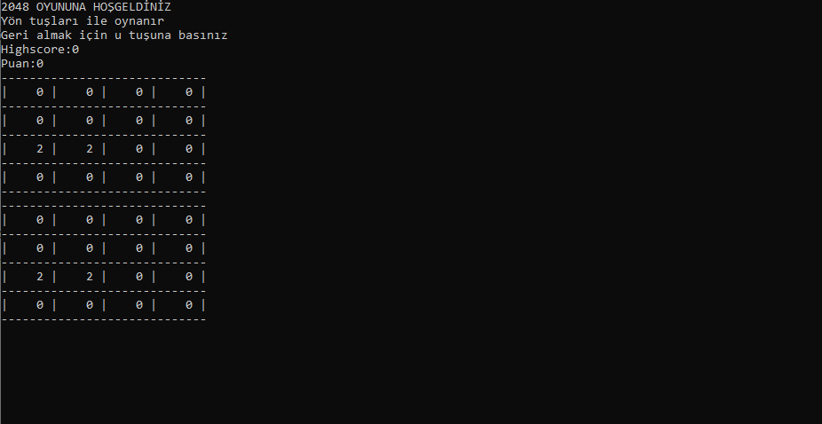

## Web Development Başlangıcım:

 
  
<!-- <a href='#m1'> sa</a> -->

Merhaba bu yazımda size web siteleri geliştirmeye nasıl, neden başladığımı ve bu yolda nasıl ilerlediğimi anlatacağım. Eğer siz de web developmenta başlamak isteyip bir türlü başlayamıyorsanız veya başlamak aklınıza hiç gelmediyse bu yazının size yardımcı olabileceğini düşünüyorum iyi okumalar.

* Benim başlama sebebim
* as

### Başlama zamanım ve nedenim:

Bilgisayar mühendisliğinde 2. sınıfın yarısına gelmiştim ve okulda bu zamana kadar yazdığımız bütün kodlar ve yaptığımız ödevler beni tam olarak mutlu etmemişti. Algoritma olarak her şey kafamda oturmuştu ama tasarım olarak çok kötüydü bu zamana kadar yaptığımız bütün uygulamalar sadece kernel üzerinden çalışıyordu ve hiç göze hitap etmiyordu. Tasarım olarak tek değiştirebildiğimiz yazıların rengiydi. Uygulamaların böyle olması beni yaptığım projelerden soğutuyordu.

  *(Ilk yaptigimiz proje 2048 oyunu)*

Hocamın yönlendirmesiyle 2. sınıfın sömestr tatilinde webe bir udemy kursundan başlangıç yaptım. Kursun linki <https://www.udemy.com/course/the-complete-web-developer-zero-to-mastery>. Kursun ilk başlangıcında temel olması için saf olarak HTML CSS ve JavaScript anlatıyordu daha önceden hiç online bir kurstan ders çalışmadığım için sadece videoları izleyip hiç uygulama yapmadan konuyu geçiyordum. Yaklaşık 1.5 hafta sonra öğrendiklerimle gördüm ki insanların çok kolay dediği HTML CSS kullanarak tasarım yapmak bana zor geliyordu ve küçücük bir uygulamayı yapmak için bile çok uzun süre CSS kodu yazmak gerekiyordu. Tasarım  işini bu kadar detaylı öğrenmek beni web işinden de soğutmuştu. Daha bir tane bile site yapmadan kursu bırakmıştım.

### Kursa geri dönmem:

